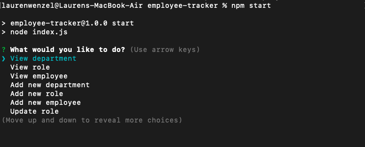
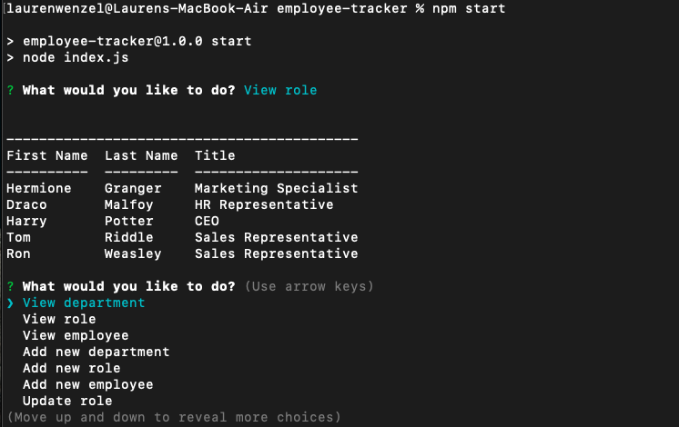

# employee-tracker
Video of Functionality: 
GitHub Page: https://github.com/Laurenzel93/employee-tracker

## User Story
```
As a business owner
I want to be able to view and manage the departments, roles, and employees in my company
So that I can organize and plan my business
```


## Acceptance Criteria
```
Build a command-line application that at a minimum allows the user to:

  * Add departments, roles, employees

  * View departments, roles, employees

  * Update employee roles
```




